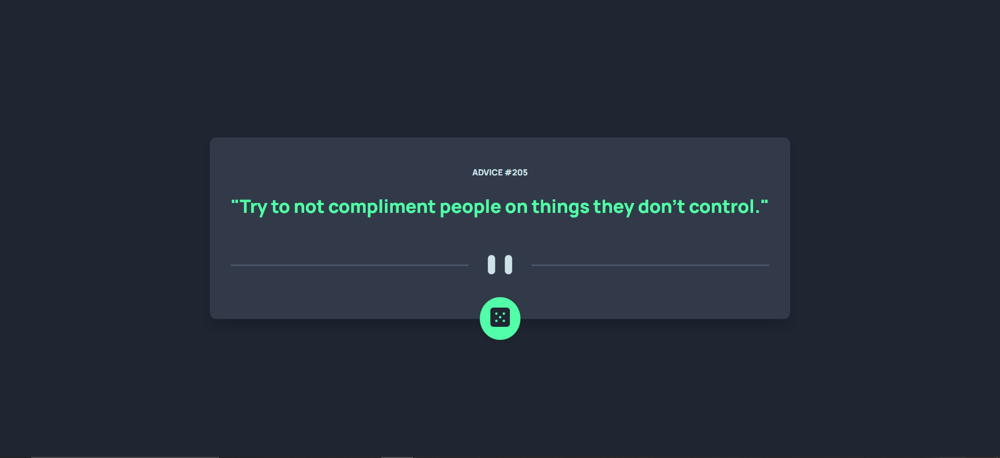

# Frontend Mentor - Advice Generator App

This is a simple Advice Generator App that displays a random piece of advice each time you press the dice button. This project is a challenge provided by [Frontend Mentor](https://www.frontendmentor.io).



## Table of Contents
- [Challenge](#challenge)
- [Features](#features)
- [Technologies Used](#technologies-used)
- [Getting Started](#getting-started)
- [Usage](#usage)
- [Live Site](#live-site)
- [Contact](#contact)
- [Acknowledgements](#acknowledgements)

## Challenge

The challenge from Frontend Mentor was to build out this Advice Generator App and get it looking as close to the provided design as possible. Users should be able to:

- View the optimal layout for the app depending on their device's screen size.
- See hover states for all interactive elements on the page.
- Generate a new piece of advice by clicking the dice button.

## Features

- Displays a random piece of advice.
- Clean and modern user interface.
- Responsive design.

## Technologies Used

- HTML
- CSS
- JavaScript
- Google Fonts (Manrope)

## Getting Started

To get a local copy up and running follow these simple steps.

### Prerequisites

- Web browser (Chrome, Firefox, Safari, etc.)

### Installation

1. Clone the repo:
   ```sh
   git clone https://github.com/your-username/advice-generator-app.git
   ```
### Usage

Open the app in your web browser. Click the dice button to get a new piece of advice.

### Live Site

Check out the live site [here](https://advice-generator-app-eight-pink.vercel.app/)

### Contact
- LinkedIn [HassanRehmen](https://www.linkedin.com/in/hassan-gill-41179a2a1/)
- Email: [hassangill9393@gmail.com](mailto:hassangill9393@gmail.com)
- Frontend Mentor [HassanRehman](https://www.frontendmentor.io/profile/HassanRehman9393)

### Acknowledgements

The advice text used in this project is inspired by [Advice Slip API](https://api.adviceslip.com/).
Icons and images are provided by [Freepik](https://www.freepik.com/).

   
